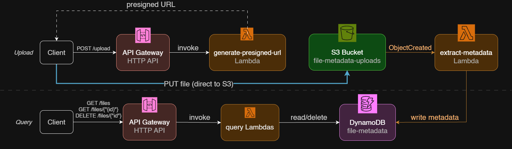

# File Metadata API

A serverless REST API for uploading files and automatically extracting their metadata. Built with AWS Lambda, API Gateway, S3, and DynamoDB.

## How it works

1. Client requests a presigned upload URL from the API
2. Client uploads the file directly to S3 using that URL
3. The S3 upload triggers a Lambda function automatically
4. That Lambda extracts the file's metadata and writes it to DynamoDB
5. Client can list, fetch, or delete file records through the API



## Tech stack

- AWS Lambda (Python 3.12)
- API Gateway (HTTP API)
- Amazon S3
- Amazon DynamoDB
- boto3

## API

Base URL: `https://be4lcmfjq8.execute-api.us-east-1.amazonaws.com/dev`

| Method | Path              | Description                                  |
| ------ | ----------------- | -------------------------------------------- |
| POST   | `/upload`         | Returns a presigned S3 URL for direct upload |
| GET    | `/files`          | Returns metadata for all uploaded files      |
| GET    | `/files/{fileId}` | Returns metadata for a single file           |
| DELETE | `/files/{fileId}` | Deletes a file's metadata record             |

**POST /upload** response:

```json
{
  "fileId": "a1b2c3d4-...",
  "uploadUrl": "https://file-metadata-uploads-robbie.s3.amazonaws.com/...",
  "s3Key": "a1b2c3d4-.../yourfile.png"
}
```

The `uploadUrl` is valid for 5 minutes; upload to it with a `PUT` request.

## Why event-driven?

This project uses an S3 event trigger to handle metadata extraction asynchronously — S3 automatically detects the client's upload.

## Design notes

- **Presigned URLs over routing uploads through Lambda** — avoids payload size limits and is cheaper.
- **HTTP API over REST API** — simpler (less features) and cheaper.
- **One Lambda per responsibility** — easier to test and reason about permissions individually.

## Limitations

No authentication or rate limiting on the API by default. A throttle limit is set on the API Gateway stage to prevent abuse/runaway cost(not production-grade access control).

## What's next

- Next.js frontend (in progress)
- Terraform for infrastructure
- API authentication

## Repo structure

```
lambdas/
  generate_presigned_url/lambda_function.py
  extract_metadata/lambda_function.py
  get_files/lambda_function.py
  delete_file/lambda_function.py
trust-policy.json
s3-lambda-policy.json
s3-notification.json
```
